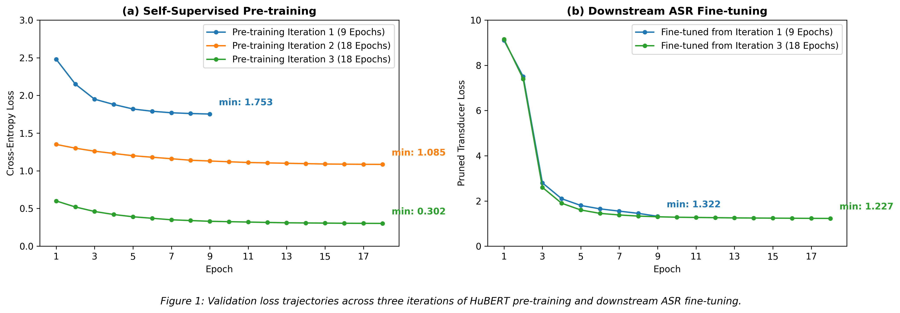

# Zipformer ASR Benchmark Toolkit
Benchmark results and deployment configuration for Zipformer ASR models on Vietnamese speech datasets.
The core contribution is a **Zipformer SSL 100h** model fine-tuned via HuBERT self-supervised learning on 100 hours of Vietnamese data.
> **Scope:** This repository is for evaluation and inference only. Training code is maintained separately.
## Benchmark Results (WER %)
| Model | Params | FLEURS | VIVOS | VLSP 2020 | Custom 10h |
| :--- | :---: | :---: | :---: | :---: | :---: |
| **Whisper Tiny** | 74M | 79.12 | 79.15 | 80.76 | 152.71 ‡ |
| **Whisper Small** | 244M | 21.15 | 22.22 | 29.47 | 20.77 |
| **Whisper Medium** | 769M | 12.23 | 18.98 | 24.07 | 12.17 |
| **Whisper Large-v3** | 1542M | 7.86 | 16.78 | 32.12 | 19.63 |
| **Zipformer SSL 100h** | **68M** | **10.71** | **6.23** | **10.47** | **9.37** |
| **Zipformer 30M 6000h** | 30M | 9.23 | 4.64 | 9.98 | 6.91 |
> ‡ WER > 100% due to hallucination on compressed meeting audio.  
> GigaSpeech 2 and Common Voice 17.0 results (Whisper Small/Medium/Large) referenced from Yang et al., GigaSpeech 2 (2024), Table 3.
## Setup
### 1. Clone & Install
```bash
git clone https://github.com/TvT-AI/zipformer-100h-docs
cd zipformer-100h-docs
pip install -r requirements.txt
```
### 2. Models
**Zipformer SSL 100h** — ONNX files already included in `models/zipformer_ssl_100h/`.
You only need to add `tokens.txt` and `bpe.model` (see `models/README.md`).
**Zipformer 30M 6000h** — Download from HuggingFace:
```bash
python -c "
from huggingface_hub import snapshot_download
snapshot_download('hynt/Zipformer-30M-RNNT-6000h',
                  local_dir='models/Zipformer-30M-RNNT-6000h',
                  ignore_patterns=['*.pt'])
"
```
**Whisper (all sizes)** — Downloaded automatically on first run. No setup needed.
### 3. Datasets
Place datasets under `data/`. Each folder has a `README.md` with detailed instructions.
| Dataset | Folder | How to get |
| :--- | :--- | :--- |
| **VIVOS** | `data/vivos/` | Download from [ailab.hcmus.edu.vn/vivos](https://ailab.hcmus.edu.vn/vivos) |
| **FLEURS** | `data/fleurs/` | Huggingface |
| **VLSP 2020** | `data/vlsp_2020/` | Register at [vlsp.org.vn](https://vlsp.org.vn) → download → see `data/vlsp_2020/README.md` |
| **Common Voice 17** | `data/common_voice_17_0/` | Huggingface |
| **Custom 10h** | `data/custom_10h/` | Private — not distributed |

**Expected folder structure after setup:**
```
data/
├── vivos/
│   └── test/
│       ├── prompts.txt
│       └── waves/
│           ├── VIVOSDEV01/
│           └── ...
├── fleurs/                    # HuggingFace dataset saved to disk
├── vlsp_2020/
│   ├── metadata.jsonl
│   └── wavs/
├── common_voice_17_0/         # HuggingFace dataset saved to disk
└── custom_10h/                # Private — skip if unavailable
    ├── recordings.jsonl
    ├── supervisions.jsonl
    └── wavs/
```
### 4. Run Benchmark
```bash
# Run all available datasets (skips missing ones automatically)
python src/main.py
# Force re-run even if results already exist
python src/main.py --force
```
Results are saved to `results/metrics/benchmark_report_<timestamp>.md`.  
Per-sample logs saved to `results/logs/`.
## Repository Structure
```
zipformer-100h-docs/
├── configs/
│   ├── benchmark_config.json          # Dataset & model registry
│   └── local_paths.example.json       # Override dataset paths locally
├── data/                              # Place datasets here (see each README)
│   ├── vivos/README.md
│   ├── fleurs/README.md
│   ├── vlsp_2020/README.md
│   └── common_voice_17_0/README.md
├── models/
│   ├── README.md                      # Model download instructions
│   └── zipformer_ssl_100h/            # Custom model ONNX files (included)
├── scripts/
│   ├── download_fleurs.py             # Auto-download FLEURS
│   └── download_common_voice.py       # Auto-download Common Voice 17
├── src/
│   ├── main.py                        # Benchmark runner
│   ├── data/loaders.py                # Dataset loaders
│   ├── models/
│   │   ├── sherpa_runner.py           # Sherpa-ONNX inference
│   │   └── whisper_runner.py          # HF Transformers inference
│   └── utils/metrics.py              # WER computation
│   └── benchmark_report.md            # Pre-computed WER table
├── docs/
│   └── loss_plot.png                  # Training loss trajectories
├── zipformer_ssl_100h/                # Training artifacts & loss logs
│   ├── plot_dynamic_from_logs.py      # Regenerate loss plot from logs
│   └── step*/log/                     # Per-step validation logs
└── requirements.txt
```
---
## Model: Zipformer SSL 100h
Fine-tuned from a HuBERT pre-trained checkpoint over **3 SSL iterations** on 100h of Vietnamese data.
| Stage | Description |
| :--- | :--- |
| **Step 1** | Initial ASR fine-tune (9 epochs) |
| **Step 2** | SSL pre-train Iter 1 (9 epochs) |
| **Step 3** | ASR fine-tune from Iter 1 (9 epochs) |
| **Step 4** | SSL pre-train Iter 2 (18 epochs) |
| **Step 5** | ASR fine-tune from Iter 2 (18 epochs) |
| **Step 6** | SSL pre-train Iter 3 (18 epochs) |
| **Step 7** | ASR fine-tune from Iter 3 (18 epochs) |
Final checkpoint: epoch 5–9 average → exported to ONNX via `sherpa-onnx`.
### Loss Trajectories

- Pre-training Iter 1 → 3: validation loss 1.753 → 1.085 → **0.302**
- Fine-tuning: pruned transducer loss 1.322 → 1.227 (Iter 1 → 3)
---
## Hardware Requirements
| Model | Engine | Minimum Hardware |
| :--- | :---: | :--- |
| **Zipformer SSL 100h** | `sherpa-onnx` | CPU 4 cores, 8 GB RAM |
| **Zipformer 30M 6000h** | `sherpa-onnx` | CPU 2 cores, 4 GB RAM |
| **Whisper Tiny** | HF Transformers | CPU / any GPU |
| **Whisper Small** | HF Transformers | GPU 4 GB VRAM |
| **Whisper Medium** | HF Transformers | GPU 8 GB VRAM |
| **Whisper Large-v3** | HF Transformers | GPU 12 GB VRAM |
## License
Code: MIT License.  
VIVOS dataset: [AILab HCMUS terms](https://ailab.hcmus.edu.vn/vivos).  
FLEURS: Apache 2.0.  
Whisper weights: MIT License (OpenAI).  
Zipformer 30M weights: Apache 2.0 ([hynt/Zipformer-30M-RNNT-6000h](https://huggingface.co/hynt/Zipformer-30M-RNNT-6000h)).
